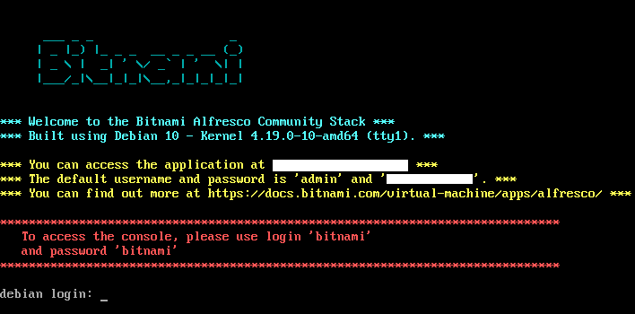

# ecm-selenium-java

Maven project with Page Object Model design pattern using Selenium + Java + TestNG + ExtentReports

The application under test (AUT) is [Alfresco Community Edition](https://bitnami.com/stack/alfresco), offered in a Virtual Machine image, provided by [Bitnami](https://bitnami.com/). Alfresco CE is an enterprise content management (ECM) allowing users to easily share and collaborate on content.

## Contents

 - [Tools](#tools)
 - [Framework](#framework)
    - [Pages](#pages)
    - [Tests](#tests)
 - [Good practices](#good-practices)
 - [Challenges](#challenges)
 - [Installation](#installation)
    - [Prerequisites](#prerequisites)
    - [How to install](#how-to-install)
    - [How to run](#how-to-run)
 - [Contact](#contact)

## Tools

- Eclipse IDE 2020-09 (Java 8)
- Maven (dependency management)
- Selenium WebDriver (web automation framework)
- TestNG (testing framework)
- Oracle VM VirtualBox (application localhost)
- ChroPath, Css and XPath checker, Developer tools (web element locators)

## Framework

*Hybrid Test Automation Framework* based on the *Modular Testing* and *Data Driven* frameworks implementing the following:

### Pages

- Page Object Model (POM)
  - Each page has its own Java class that:
    - encapsulates web elements
    - implements user actions through methods
- Page Component Pattern
  - Composition for shared page components instead of inheritance which can leads to maintenance issues
- Usage of a `BasePage` class for low-level common UI actions
- Usage of a `Page` class for browser actions

### Tests

- Fluent Design Pattern
  - makes test case steps easier to follow thanks to a chained flow within `pageObjects` actions and between `pageObjects` (page transition)
- Usage of a `BaseTest` class:
  - `@BeforeSuite` for reading the `test-config.properties` only once per suite
  - `@BeforeClass` for initializing the driver
  - `@AfterClass` for closing the driver
- Test classes:
  - `@DataProvider` for data driven approach
  - `@BeforeMethod` for preconditions
  - `@AfterMethod` for post-conditions
  - `@Test` for validating functionalities with methods from `Assert` & `SoftAssert` classes
- No static driver because it causes problems for parallel execution
- Parallel execution with TestNG to achieve Cross-browser testing
- TestNG listeners for test report generation with ExtentReports logging test case steps

## Good practices

- Management
  - Project structure with meaningful class and package names
    - pages are located under `src/main/java`
    - tests are located under `src/test/java`
    - resources are located under `src/main/resources` and `src/test/resources`
    - reports are located under `test-output/reports` and screenshots under `test-output/screenshots`
- Implementation
  - Commented code
  - Variables
    - meaningful variable names
    - camelCase naming convention
    - `final` variables in all caps
  - Proper usage of Java modifiers (`public`, `private` and `protected`)
  - Thread safe code to handle parallel execution
  - No hardcoded sleep
  - Read configuration and test data from `.properties` and `.csv` files

## Challenges

- Building custom XPath for dynamic web elements
- Handling different web elements load time
- Deciding between inheritance and composition (IS A vs HAS A)
- Changing some locators after application updates
- Refactoring my previous Framework

## Installation

### Prerequisites:

- Java 8 or later (JDK)
- Maven
- Java integrated development environment (IDE) (e.g., Eclipse IDE and IntelliJ IDEA)
- TestNG Plugin
- Virtualization software to run the app
- Chrome, Edge and Firefox browsers
- Git Bash

On the virtual machine console,

<p align="center"></p>

note the application URL and default password and do the following modifications:

- In the maven `pom.xml` file, inside `maven-surefire-plugin`, change the `url` system property variable.
- In the `config-test.properties` file, under `src/test/resources/com/app/config`, change the `PASSWORD` value.

### How to install:

Type the following command in Git Bash:

```bash
$ git clone https://github.com/mk-sdet/ecm-selenium-java.git
```

or simply download the repo and unzip it into your favorite folder.

### How to run:

#### In parallel on a single browser:

In Eclipse IDE, right-click the `testngParallel{browser-name}.xml` file and under "<ins>R</ins>un As" choose "<ins>1</ins> TestNG Suite".

<p align="center">OR</p>

In IntelliJ IDEA, right-click the `testngParallel{browser-name}.xml` file and choose "R<ins>u</ins>n PATH".

<p align="center">OR</p>

In `cmd`/`terminal`, run the following maven command inside the project directory:

```bash
mvn clean test -DsuiteXmlFile=testngParallel{browser-name}.xml
```

where {browser-name} can be either Chrome, Edge or Firefox.

#### In parallel on multiple browsers (Chrome, Edge and Firefox):

Same instructions, but replace `{browser-name}` with `CrossBrowser`.

## Contact

Created by [Muana Kimba](https://www.linkedin.com/in/mkimba)
